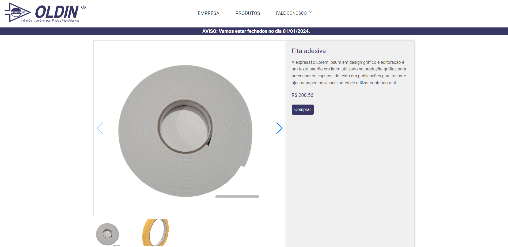

# Oldin Grampos Website Documentation

## Overview

Welcome to the documentation for the Oldin Grampos website. This documentation provides an overview of the project's purpose, features, structure, and key learnings during development.

**Visit Oldin Grampos Website: https://oldin.vercel.app/**

### Purpose

The Oldin Grampos website serves the dual purpose of facilitating customer purchases and communicating special offers while also providing information about the company. It includes various pages such as the home page, product pages, specific product pages, about us, job opportunities, and Oldin's contact page.

### Features

1. **Product Search and Filters:**
   - The website incorporates logic for product searches using filters or a search bar.
   - Users can easily refine their product searches based on specific criteria.

2. **Backend Integration with XANO:**
   - The backend, developed using XANO, integrates seamlessly with tables containing product and announcement data.

3. **Dynamic Announcements:**
   - The website features dynamic announcements in the header that can be toggled on or off based on decisions made by the Oldin staff.

4. **Product Purchase via whatsapp:**
   - The website facilitates purchasing communication between the customer and Oldin, by creating a text with the product specifications and sending it by whatsapp to Oldin Grampos.

## Pages

### Home Page

### Company Page

### Product Page

### Specific Product Page

### Work With Us Page

### Contact Us Page

## Learning Points

In the course of developing the Oldin Grampos website, several learning points emerged:

1. **React.js Proficiency:**
   - The project significantly enhanced proficiency in React.js, a powerful JavaScript library for building user interfaces.

2. **Library Usage - Swiper:**
   - Learnings include the effective use of libraries like Swiper for smooth and interactive image sliders.

3. **Performance Optimization:**
   - Encountering performance issues with frequent header updates, the solution involved implementing local storage caching for improved performance.

4. **Client-Centric Problem Solving:**
   - Understanding client needs was pivotal for effective problem-solving, ensuring the website addressed specific requirements.

5. **Design Consistency:**
   - The design of the website was refined, adhering to a consistent color scheme and visual pattern.

## Conclusion

The Oldin Grampos website is a combination of effort and technical learning to meet the customer's needs. The project not only helps Oldin Grampos to have better digital visibility, but also brings the customer an easier online contact experience for purchases. Enjoy navigating through the website!
